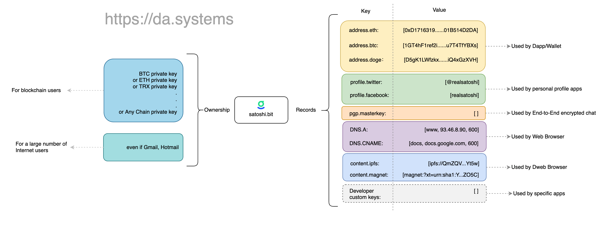

# Introduction

> DAS is to the crypto world what Email/Mobile is to the Internet.

DAS is a blockchain-based, open source, censorship-resistant decentralized account system that provides a globally unique naming system with a .bit suffix that can be used for cryptocurrency transfers, domain name resolution, authentication, and other scenarios. As a decentralized account system, only the user has full control and access to the DAS account. Also, DAS is the first decentralized account system with broad compatibility, allowing registration and management of DAS accounts using any public chain address or even email.

The core elements of a DAS account are: the owner/administrator, and the resolution record (i.e. the data it is associated with). Unlike ENS, the owner/administrator of DAS can be any public chain private key or even email; unlike DNS, DAS supports any type of resolution record.

The structure of a DAS account is as follows.

DAS is a decentralized application running on [Nervos CKB](https://www.nervos.org/). DAS accounts and account resolution records are stored on the chain. Nervos CKB is a PoW public chain with a highly open architecture using the UTXO model. components, including.

1. **Core Protocol**

   This refers to a series of Lock Scripts and Type Scripts deployed on the Nervos CKB, which define the DAS accounts and related operational standards for DAS accounts, and are concrete implementations of the DAS core protocols. 2.

2. **Keeper**

   Keeper is a set of off-chain programs that can be run by anyone without a license, and is responsible for triggering a series of transactions that conform to the core protocol. Running a Keeper earns DAS system rewards.

3. **Resolution Service**

   It resolves the global state of DAS based on the transactions on Nervos CKB and provides account resolution service in the form of an interface to the public.

4. **Client SDK**

   Includes SDKs in various languages to simplify the integration of mobile wallets, web wallets, server wallets and other DAS-related applications.

5. **Dapp UI**

   Users ultimately use the various features of DAS through a variety of application interfaces. These applications can be used directly in the browser or can be integrated into popular wallet software.

The source code for all the above components can be found in our Github repository. Also, developers can implement their own Keeper, Resolution Service, Client SDK, Dapp UI based on Core Protocol.

