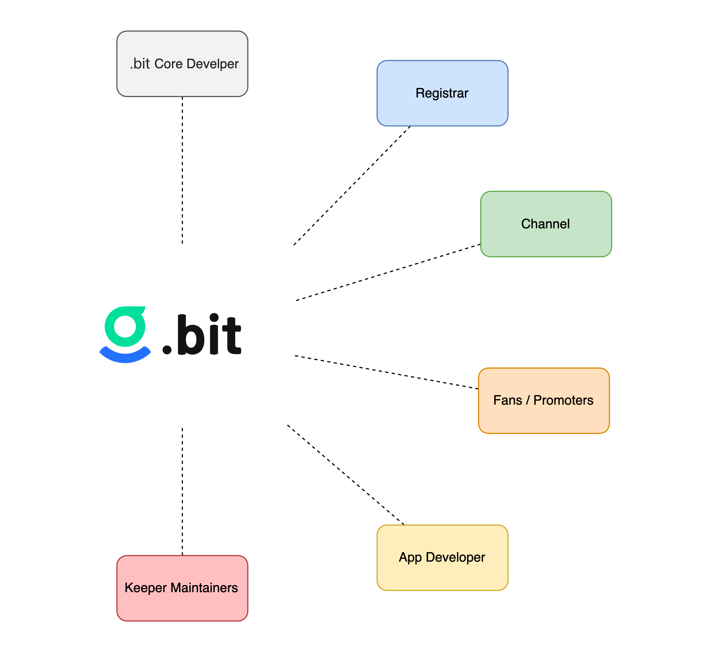

#  Contribute to .bit

.bit is committed to become the infrastructure of the crypto world, which can't be built without the joint effort from the community. We believe a well-designed revenue sharing system can make .bit community grow faster. We expct every .bit community member to earn the corresponding rewards from contributing to the growth of .bit.

There are several roles we identify   in the ecosystem and please note any organization/individual can play multiple roles at the same time. 

| Roles                                            | Responsibilities                                             | Rewards/Bonus                                                |
| ------------------------------------------------ | ------------------------------------------------------------ | ------------------------------------------------------------ |
| [Registrar](registrar.md)                        | Provide users with an interface to register/manage/renew their .bit account (Dapp UI). | Currency exchange premium; sale channel bonus; promotion rewards; parallel market revenue, etc. |
| [Agent](Agent.md)                            | Take advantage of your clout and bring the users with the Dapp UI provided by the registrars. | Sale Bonus: 10% of registration fee                       |
| [Promoter](referral.md)                           | Promote .bit to your friends in social medias and invite them to use .bit. | Promotion bonus: 10% of the registration fee                 |
| [Developers](../developers/build-application.md) | Develop applications based on .bit.                           | Depend on the business model of the application itself      |
| [Keeper](keeper.md)                              | Write your own Keeper program and participate in .bit proposal transactions. | Reward: 2% of the registration fee                           |

The Sale Channel rewards, Promotion rewards, and Keeper rewards are implemented at the contract level, and the rewards will use real time gross settlement for the corresponding roles.

E.g. A user registers a .bit account through https://app.gogodas.com?inviter=dasdeveloper.bit&channel=imtokenreferral.bit. The inviter -`dasdeveloper.bit` - will get the promotion bonus, which is 10% of the registration fee. The agent - `imtokenreferral.bit` - will get the sale channel bonus, which is 10% of the registration fee. And the registrar - gogodas.com - will get a bonus for a certain amount of ETH converted to CKB. The registrar's final rewards are decided by the premium percentage set by himself.

.bit is an open source project with smart contracts deployed on the blockchain. Anyone can participate in building .bit without permission. Let's build together!
