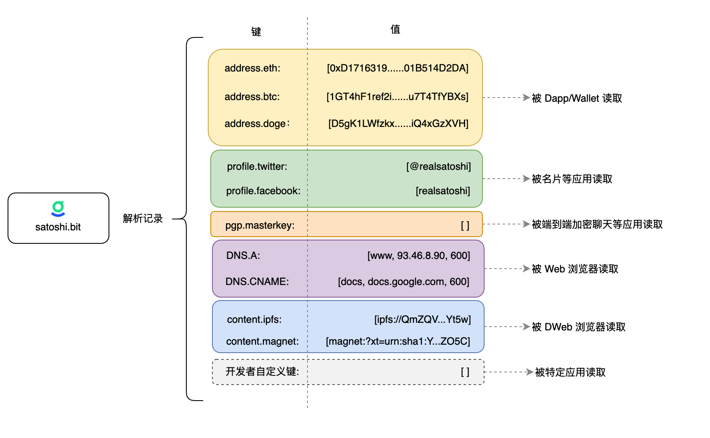

# 解析记录命名空间

解析记录是 DAS 的核心，DAS 的强大扩展能力也来源于解析记录的灵活性。一条解析记录是一个 key-value 的键值对，DAS 支持无数条解析记录。如上图，不同的应用会读取不同的解析记录，以完成不同的工作。因此，解析记录的 key 的命名空间管理，显得尤为重要。命名空间使用规范，本质是一个协议，遵循这个协议，应用程序之间可以实现良好的协作。

## 命名空间

解析记录的 key，是一个使用`.`分隔的层级结构，如`address.btc`，`profile.twitter`，`custom_key.bitcc_config`等。其中，`address`，`profile`，`custom_key`称为一级命名空间；`btc`，`twitter`，`bitcc_config`称为二级命名空间。

DAS 在合约层面对命名空间的使用有严格的约束，目前提供了四个一级命名空间。

* **address**

  该命名空间一般用于存放用户的数字资产收款地址，如`address.btc`，`address.eth`等。同时，合约内部有一个[白名单](https://github.com/DeAccountSystems/cell-data-generator/blob/master/data/record_key_namespace.txt)，内置了主流数字资产符号作为合法的 key。

* **profile**

  该命名空间一般用于存放用户的个人信息，如`profile.twitter`，`profile.facebook`等。同时，合约内部有一个[白名单](https://github.com/DeAccountSystems/cell-data-generator/blob/master/data/record_key_namespace.txt)，内置了主流社交网络名作为合法的key。

* **dweb**

  该命名空间一般用于存放去中心化网络相关的内容，如`dweb.ipfs`，`dweb.resilio`等。同时，合约内部有一个[白名单](https://github.com/DeAccountSystems/cell-data-generator/blob/master/data/record_key_namespace.txt)，内置了主流的去中心化存储协议名作为合法的key。

* **custom_key**

  该命名空间没有约束，开发者可以在这个空间下创建任意名字和数量的次级命名空间，并定义其含义。如`custom_key.bitcc_config`，`custom_key.pgp.master_key`等。 

需要注意的是，DAS 合约并不会校验解析记录的值的合法性，DAS 只是提供了一种约定。例如，一般情况下用户都会将 `address.btc` 的值设置为一个 BTC 地址。但应用程序在使用这个值时，应该检查这个值是否真的是合法的 BTC 地址。

## 一级命名空间的增加

目前 DAS 只提供了`address`，`profile`，`dweb`，`custom_key`四个一级命名空间，但这不是最终结果。DAS 团队会根据情况，逐渐增加一级命名空间。同时，我们也需要社区的开发者给我们提供有效的建议。如果您认为应该增加某些命名空间，使得应用程序之间可以更好的协作。可以在 Github 中给我们提 [Issues](https://github.com/DeAccountSystems/das-contracts/issues)。

