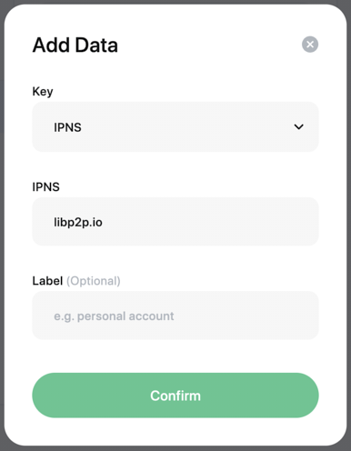

# data.did.id
Manage your .bit accounts' data in the most elegant way.

## Introduction
[data.did.id](https://data.did.id) is an elegant data management tool for your .bit accounts.

With `data.did.id`, you can check the data of any .bit account, including but not limited to the following data:  
- Personal Profile (profile)
- Crypto Assets Address (address)
- Decentralized Web (dweb)
- Customized Data (custom)
- Permissions (owner/manager)
- ...

If you are the **owner or manager** of a .bit account, you can also manage the data of this account or change the permissions of the account.

If you are a **developer**, you can even make users to [Update .bit account via URL query](#update-bit-account-via-url-query)  

> In a word, any action related to account management can be made here.

## Update .bit account via URL query

Each day many developers are exploring the way to create interesting applications that incorporate with .bit.

In this rapid development period of blockchain industry, it is crucial to quickly verify the feasibility of a business model instead of spending too much time on the research of infrastructure.

With [data.did.id](https://data.did.id) , developers can change users' data with a very simple yet elegant way without having to worry about complicated on-chain operations.

> [Click here to see an example →](https://data.did.id/dasdeveloper.bit?records=%5B%7B%22action%22%3A%22add%22,%22key%22%3A%22profile.website%22,%22value%22%3A%22https%3A%2F%2Fdid.id%22%7D,%7B%22action%22%3A%22delete%22,%22key%22%3A%22profile.twitter%22%7D,%7B%22action%22%3A%22replace%22,%22key%22%3A%22profile.avatar%22,%22value%22%3A%22https%3A%2F%2Fdata.did.id%2Ffavicon.ico%22%7D%5D) Notice: It's not your account.

### Quick Start

[data.did.id](https://data.did.id) will read the `records` query on URL。

Developers only need to fill in specific params according to the spec, and then guide users to visit the corresponding link. After users click on the confirm button, the data will be changed successfully. 

It's general process is as follows:
```javascript
const records = [{
  action: 'add',
  key: 'profile.website',
  value: 'https://did.id',
}, {
  action: 'delete',
  key: 'profile.twitter',
}, {
  action: 'replace',
  key: 'profile.avatar',
  value: 'https://data.did.id/favicon.ico',
}]

const queryString = window.encodeURIComponent(JSON.stringify(records))

window.open(`https://data.did.id/dasdeveloper.bit?records=${queryString}`)
```
After opening the corresponding link, the user will see a page similar to the following:


After the user confirms, the data will be updated.

This process eliminates complex on-chain operations and does not compromise the security of user data.

### Query: `records`
The 'records' query is an array, each of which is an action to the current .bit account, including the following actions:
- Add (add)
- Delete (delete)
- Replace (replace)

> Note that the value of `records` query must be a valid JSON string and should be escaped by `encodeURIComponent`.

According to different actions, there are different parameter requirements, as shown below:

#### Add Data: add
This action will add a corresponding .bit data.

> If the same keys exist, the previous keys would not be overwritten. The new and old data will exist at the same time.

```javascript
const records = [{
  action: 'add',
  key: 'profile.twitter',
  value: 'dotbit',
  label: 'dotbitHQ',
  ttl: 300,
}, {
  action: 'add',
  key: 'profile.website',
  value: 'https://did.id',
}]
```

#### Delete Data: delete
This action will delete the corresponding .bit data. 

> If there are multiple same keys, then all the same keys will be deleted.

```javascript
const records = [{
  action: 'delete',
  key: 'profile.twitter',
}, {
  action: 'delete',
  key: 'profile.website',
}]
```

#### Update Data: replace
This action will replace all the corresponding .bit data.

> Because .bit allows more than one key exsited, there is no way to specify which key to change through the URL parameter.
>
> So if you want to change the key, you need to do the "update" operation by completely replacing it  .
>
> In this case, the new key is used to completely replace all the previous keys. If there are multiple same keys before, they will all be overwritten by the new data.

```javascript
const records = [{
  action: 'replace',
  key: 'profile.avatar',
  value: 'https://data.did.id/favicon.ico',
}]
```

Therefore, if you want to modify the data for a key, you need to use "replace" operation.

### Caveat
Because of the semantic ambiguity of multiple actions, we do not recommend using multiple different `action` on the same key, as it may result in different results than expected.

## DWeb
.bit supports a variety of decentralized storage protocols, currently supporting IPFS, Arweave, Resilio, Skynet, and allows users to quickly access content on decentralized storage through the bit.cc subdomain corresponding to their .bit account.

### DNSLink
The .bit account supports setting up IPNS and already supports [DNSLink](https://dnslink.io/). you can refer to the [DNSLink tutorial](https://dnslink.io/#tutorial), add a `_dnslink` resolution record to the DNS of your domain, and then set the IPNS of your .bit account to your domain name. when you access the corresponding bit.cc subdomain, the corresponding IPFS content will be presented.

Take the .bit account `bestcase.bit` as an example, first refer to the [DNSLink tutorial](https://dnslink.io/#tutorial) and add the following DNS resolution record to the domain `libp2p.io`

```shell
> my-dns-tool set \
    --type=TXT \
    --ttl=60 \
    --domain=libp2p.io \
    --name=_dnslink \
    --value="dnslink=/ipfs/Qmc2o4ZNtbinEmRF9UGouBYTuiHbtCSShMFRbBY5ZiZDmU"
```

After adding the DNS resolution record, set the IPNS value of `bestcase.bit` to `libp2p.io` using [data.did.id](https://data.did.id), as follows



Once set, you can visit the `bestcase.bit` subdomain [bestcase.bit.cc](https://bestcase.bit.cc/) to see if the settings are in effect.

For DNSLink tutorials, usage examples, and FAQs, please see [dnslink.io](https://dnslink.io/).
