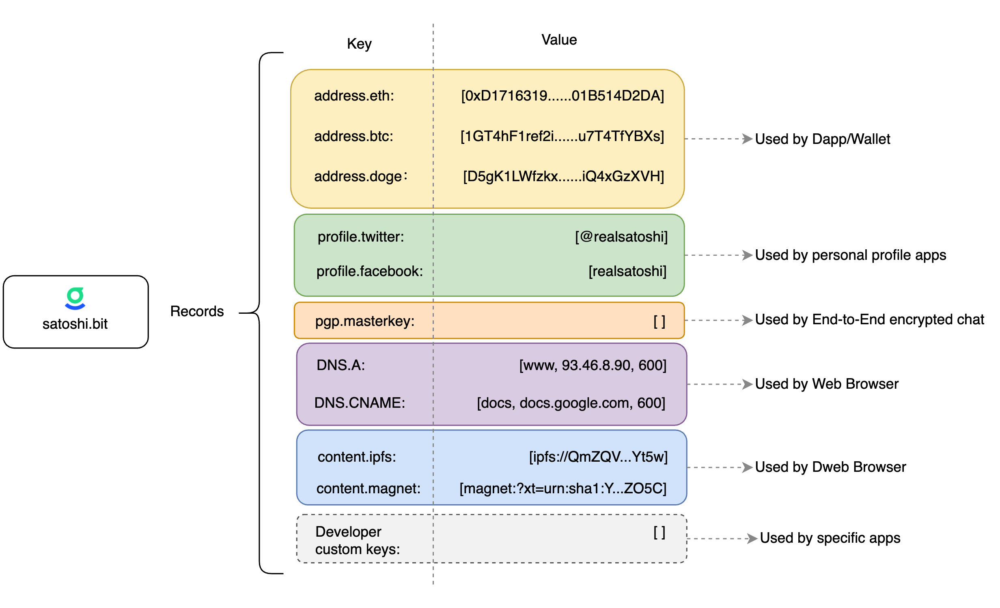

# .bit Data Container

The .bit Data Container is the core capability of .bit, and its powerful extension capabilities also come from the flexibility of parsing records.
Each .bit account has a data container in which users can store different data, which is called a parsing record.

Its basic structure is as follows:



Developers can use APIs or SDKs to read different parsing records to complete different tasks, such as wallet transfers, community identity, Dweb, and so on. The data structure obtained by developers is generally as follows:

```json
[
  {
    "key": "address.60",
    "value": "0x1D643FAc9a463c9d544506006a6348c234dA485f",
    "label": "personal",
    "ttl": "300"
  },
  {
    "key": "address.60",
    "value": "0xf0e630b51f1d9ef735b956bc10fedb813cb78002",
    "label": "business",
    "ttl": ""
  },
  {
    "key": "profile.twitter",
    "value": "dotbithq",
    "label": "",
    "ttl": ""
  }
]
```
## Parsing Record
Each piece of data associated with a .bit account, such as a BTC address or a Twitter account, is called a parsing record.

Each parsing record is a combination of a key and a value, along with a label and time-to-live (TTL).

### Parsing Record Namespace
Since parsing records are essentially key-value pairs of strings, in theory, any type of data can be stored. However, to ensure consistency and cooperation within the ecosystem, we have standardized the parsing record namespace. It is essentially a protocol that, when followed, enables good cooperation between applications. There are three main types:

- **address**  
  This type of parsing record is mainly used to record users' blockchain addresses, including ETH, BTC, DogeCoin, and so on. They are in the form of `address.0`, `address.60`, etc.  
  Here, `0` and `60` represent specific blockchains, following the SLIP-0044 specification. For specific definitions, see [SLIP-0044](https://github.com/satoshilabs/slips/blob/master/slip-0044.md).

- **profile**  
  This type of parsing record is mainly used to record users' personal social information, including Twitter, email, Telegram, and so on. They are in the form of `profile.twitter`, `profile.email`, and so on.

- **dweb**  
  This type of parsing record is mainly used to record users' decentralized storage information, including IPFS, Arweave, and so on. They are in the form of `dweb.ipfs`, `dweb.arweave`, and so on.

Only keys of the specified namespace can be set for the above three types of parsing records.

> View the specific whitelist: [.bit Parsing Record Namespace](https://github.com/dotbitHQ/cell-data-generator/blob/master/data/record_key_namespace.txt)

- **custom_key**  
  To meet developers' personalized needs, we have added the `custom_key` type.  
  This namespace is unconstrained, and developers can create any number of sub-namespaces with different names and define their meanings under this namespace. For example, `custom_key.bitcc_config`, `custom_key.pgp.master_key`, and so on.

### Parsing Record Key
The namespace and subtype together form the key of the parsing record.

Multiple identical keys can exist within a .bit account. To differentiate between parsing records, labels are used.

### Parsing Record Value
The .bit contract does not verify the legality of the value of parsing records. .bit only provides a convention. For example, users generally set the value of `address.btc` to a BTC address. However, when an application uses this value, it should check whether it is a valid BTC address.

### Parsing Record Label
Different labels can even be set for different BTC/ETH addresses. In fact, multiple records of the same type can be added in .bit, differentiated by custom labels.

## FAQ

### Can multiple BTC/ETH addresses be added as resolution records to a .bit?

Yes. You can add multiple identical keys, such as multiple ETH addresses or multiple Twitter accounts.

Taking ETH addresses as an example, in real life, each of us has multiple addresses: personal addresses, company addresses, home addresses, and so on. If there is only one record for a key, it obviously cannot fully reflect real life.

To reflect the user's actual situation, we allow multiple identical keys to exist under a .bit account.

### How to distinguish resolution records with the same key?
Use labels to distinguish them. For details, see [Resolution Record Labels](#resolution-record-labels).

### How to add resolution types?
Currently, .bit only provides four primary namespaces: `address`, `profile`, `dweb`, and `custom_key`. However, this is not the final result. The .bit team will gradually add primary namespaces according to the situation. At the same time, we also need developers from the community to provide us with effective suggestions. If you think that certain namespaces should be added to better collaborate between applications, you can give us [Issues](https://github.com/dotbitHQ/cell-data-generator/blob/master/data/record_key_namespace.txt) on Github.

### How many resolution records can a .bit account have?

This depends on the size of Witness data that can be accommodated in a single CKB transaction.

Generally speaking, a .bit account can store hundreds of resolution records, which is completely sufficient for ordinary users.

### Can resolution records be modified?

Yes, they can be modified at any time. However, different operations will have different frequency restrictions to prevent abuse. Please refer to the prompts during the operation.

### What is a `custom_key`?

.bit has built-in some types of resolution records, such as blockchain addresses and personal information. At the same time, it also supports users and developers to customize resolution record types to support rich application scenarios.
See also: [Resolution Record Namespace](#resolution-record-namespace).
