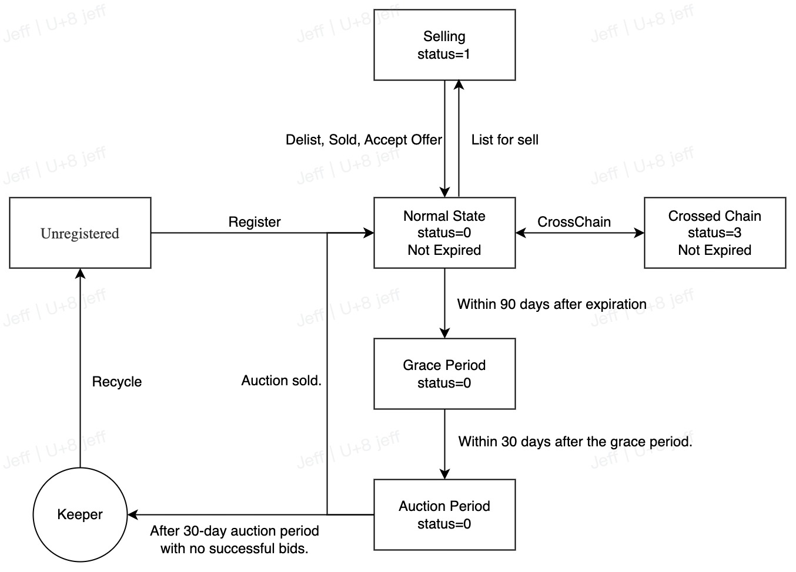

# Account Status & Lifecycle
The status of .bit accounts is complex and requires a careful understanding of the definitions of each state and their transition relationships in order to better develop based on .bit and provide the best experience for users.

### On-chain status of accounts
From on-chain data, .bit accounts have the following states:

| Status      | Value | Description                                       |
|-------------|-------|---------------------------------------------------|
| Normal      | 0     | Account is being used normally                    |
| Selling     | 1     | Account is being sold                             |
| Cross-chain | 3     | Account is in the process of cross-chain transfer |

You can try the following command to view the status of a specific account:

```shell
curl -X POST https://indexer-v1.did.id/v1/account/info -d'{"account":"jeffx.bit"}'
```

### Account Logical Status
From a practical business perspective, accounts have the following logical states:

**Unavailable**  
Included in the [unavailable account name list](https://github.com/dotbitHQ/cell-data-generator/blob/master/data/unavailable_account_hashes.txt) (blacklist).

**Reserved**  
Included in the [reserved account name list](https://github.com/dotbitHQ/cell-data-generator/blob/master/data/reserved_accounts.txt).

**Not yet open for registration**  
Not on the blacklist or reserved list and not yet hit by the open registration algorithm. View the [open registration algorithm](../register-das/open-registration-rules.md).

**Not registered**  
Registration is open, but the name has not yet been registered and can be registered by users at any time.

**Registered (normal use)**  
The account name has been registered (account-cell.status=0).

**Selling**  
The account has been registered and is listed on the [transaction market](https://did.top/) (account-cell.status=1).

**Cross-chain**  
The account has been registered and [crossed to ETH](./eth-nft.md) (account-cell.status=3).

**Expiring soon**  
The account will expire within 30 days.
> Criteria: current time <= account-cell.expired_at <= current time + 30 days.

**Grace period**  
The account has expired within 90 days and has not yet been recovered.
> Criteria: current time-90 days <= account-cell.expired_at <= current time.

**Auction period (under development)**  
The account has expired, has been recovered by the system, and entered a 30-day discounted auction period.
> Criteria: current time-120 days <= account-cell.expired_at <= current time-90 days.

### Operations in Each State
Due to the complex state transitions, we list the available operations for each state as follows:

|            Status             | Register | Renew | Edit | Reverse Lookup | Put on Sale | Take off Sale | Change Price | Purchase | Bid | Modify Bid | Bid Accepted |
|:-----------------------------:|:--------:|:-----:|:----:|:--------------:|:-----------:|:-------------:|:------------:|:--------:|:---:|:----------:|:------------:|
|          Unavailable          |    ❌     |   ❌   |  ❌   |       ✅        |      ❌      |       ❌       |      ❌       |    ❌     |  ✅  |     ✅      |      ❌       |
| Not yet open for registration |    ❌     |   ❌   |  ❌   |       ✅        |      ❌      |       ❌       |      ❌       |    ❌     |  ✅  |     ✅      |      ❌       |
|        Not registered         |    ✅     |   ❌   |  ❌   |       ✅        |      ❌      |       ❌       |      ❌       |    ❌     |  ✅  |     ✅      |      ❌       |
|          Registered           |    ❌     |   ✅   |  ✅   |       ✅        |      ✅      |       ❌       |      ❌       |    ❌     |  ✅  |     ✅      |      ✅       |
|            Selling            |    ❌     |   ✅   |  ❌   |       ✅        |      ❌      |       ✅       |      ✅       |    ✅     |  ✅  |     ✅      |      ❌❗      |
|          Cross-chain          |    ❌     |   ❌   |  ❌   |       ✅        |      ❌      |       ❌       |      ❌       |    ❌     |  ✅  |     ✅      |      ❌       |
|         Grace period          |    ❌     |  ✅❗   |  ❌   |       ✅        |      ❌      |       ❌       |      ❌       |    ❌     |  ✅  |     ✅      |      ❌       |
|        Auction period         |    ❌     |   ❌   |  ❌   |       ✅        |      ❌      |       ❌       |      ❌       |    ❌     |  ✅  |     ✅      |      ❌       |

**Special States**
1. Lock and mint for cross-chain operation
- Expiring soon (within 30 days before expiration): Cannot lock the account.
- Grace period (within 90 days after expiration): Cannot lock during the grace period, but can mint.
2. Bid accepted
- Accounts in the selling state need to be taken off sale before the bid can be accepted with another user.
3. Renewal
- If an account is in the grace period and in the cross-chain state, it cannot be renewed and must be transferred back to the Nervos chain first to ensure consistent states between chains.

### Major State Transitions (Lifecycle)


## FAQ

### What Happens to My Account After It Expires?

:::tip
The current discount auction mechanism is not yet in use. After the 90-day grace period, the account will be directly reclaimed.
:::

After the expiration time of a .bit account, it enters a 90-day grace period.

If the renewal is completed within the grace period, you will still have ownership of the .bit account.

If renewal is not completed during the grace period, the .bit account will enter a 30-day [discount auction](https://en.wikipedia.org/wiki/Reverse_auction) period, and the first bidder will receive the account.

If there are no bids at the end of the auction period, the account will become publicly available for registration at a price determined by the number of characters in the account name.

### Why Was My Account Reclaimed Without Entering the Discount Auction Period?

The discount auction mechanism is not yet in use, so after the grace period, accounts will be directly reclaimed. Anyone can register the account.

### Will My .bit Account Converted to an Ethereum NFT Also Be Reclaimed?

Yes. Regardless of whether your .bit account has been converted to an Ethereum NFT or not, if it is not renewed within the grace period, it will be automatically reclaimed.

### I Paid in ETH/BNB/MATIC/TRX When I Registered. Why Am I Getting My Deposit Back in CKB?

.bit is a set of smart contracts running on Nervos CKB. The contracts can only recognize and accept CKB as a payment method.

To make it easier for users to obtain .bit, we introduced the unique role of [registrars](../contribute-to-das/registrar.md).

Registrars provide registration interfaces and can accept different tokens, such as ETH, BNB, MATIC, TRX, USDT, and even fiat currencies, for .bit registration.

The storage deposit is automatically refunded to the account owner in CKB when the .bit contract reclaims the account, so the refund will be in CKB.

### Will the Storage Deposit Be Refunded Automatically After the Account Is Reclaimed?

Yes. After the account is reclaimed, the storage deposit will be automatically refunded to the original owner's [.bit balance](https://balance.did.id/). You can check it using the corresponding wallet address on the [.bit balance](https://balance.did.id/) website.

### Where Can I Check the Refunded Storage Deposit?

You can check the automatically refunded storage deposit in your [.bit balance](https://balance.did.id/).

### Why Is There a Delay in Account Reclamation?

The account expiration time is based on the on-chain time. The time it takes to reclaim an account depends on the CKB network and is expected to take 10 to 30 minutes. [Check the on-chain time](https://app.did.id/explorer). 
