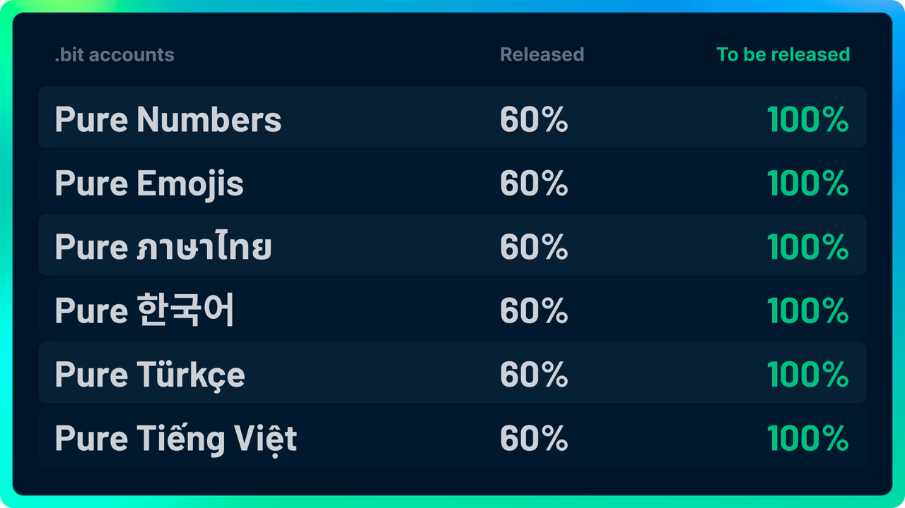

# 开放注册规则

.bit 账户作为一种公共资源，应避免在社会影响力不足时被少数人所囤积。.bit 账户注册采取逐步开放的策略。

| 账户字符长度  | 开放注册规则     |
|:--------|:-----------|
| 10位及以上  | 全部开放注册。    |
| 4～9位    | 详见下方**注意** |
| 1~3位    | 待定。        |

:::tip 注意
截止 2022-10-19，.bit 账户的4~9 位，已随机释放至 60%。

纯数字，纯 Emoji，纯泰文字符，纯谚文字符释放至 100%。

剩下账户的释放计划还在计划之中，敬请期待。
:::

## 释放计划 2022-10-19
鉴于越南文字符集、土耳其文字符集和英文字符集之间存在交集，为避免放开带来的潜在问题，我们将越南文、土耳其文的释放比例和英文保持一致。

至此，纯越南文，纯土耳其文，纯英文字符集释放比例均为 **60%**。  

其他字符集释放状态和 2022-10-18 释放计划保持一致。

## 释放计划 2022-10-18
鉴于 .bit 已经和主流钱包和 Dapp 互相集成，.bit 的独立地址数已经达到了一个新的台阶，并且生态足够活跃，
同时，.bit 首创的 NameDAO 成功地扩大了 .bit 的影响力和社区规模。

因此，我们计划在 10 月 18 日 12:00 PM (UTC+0) 开启新一轮账户释放，继续推动 NameDAO 的发展。

#### 释放细节
所有字符长度在 4 位及 4 位以上的纯数字 .bit，纯 Emoji .bit，纯泰文字符 .bit，纯韩文字符 .bit，纯土耳其字符 .bit，纯越南字符 .bit 均可注册。

## 释放计划 2022-03-09

出于公平考虑，目前只有 35% 的 .bit 账户是可随机注册的。
随着 .bit 与更多 DApp 的集成以及 .bit 品牌知名度的提高，我们认为是时候发布更多帐户了。

随着我们的品牌升级，我们特此公布释放计划。

#### 释放轮次
2022–03–21 8:00PM(UTC+8)，释放至40%；  
2022–03–28 8:00PM(UTC+8)，释放至45%；  
2022–04–04 8:00PM(UTC+8 )，释放到 50%；  
2022–04–11 8:00PM(UTC+8)，释放到 55%；  
2022–04–18 8:00PM(UTC+8)，释放到 60%；  

> 账号具体释放时间可通过在 [https://d.id/bit/reg](https://d.id/bit/reg) 页面搜索帐户查询。（仅可查询即将新一轮释放的 25% 帐户）

#### 每轮释放参数
释放到 40% = 1717986918  
释放到 45% = 1932735282  
释放到 50% = 2147483647  
释放到 55% = 2362232012  
释放到 60% = 2576980377  

> **释放规则代码和参数：**
> 
> [算法代码](https://github.com/dotbitHQ/das-contracts/blob/7717330047772f51855d79bd67b77dede34d0bf8/contracts/pre-account-cell-type/src/entry.rs#L597-L630)
> 
> [参数代码](https://github.com/dotbitHQ/das-contracts/blob/7717330047772f51855d79bd67b77dede34d0bf8/contracts/pre-account-cell-type/src/entry.rs#L607)

剩余的40%将根据未来拥有者地址的数量逐步释放。