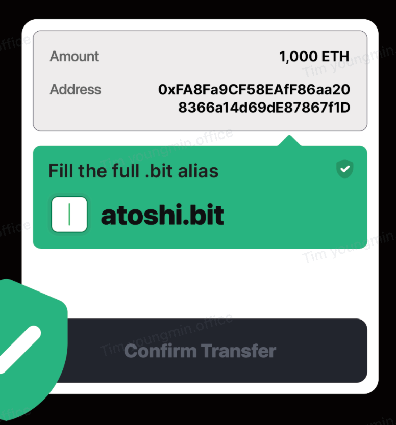

# .bit 别名（Alias）

## 背景
在 Web3 世界里，我们经常需要使用各种各样的地址，如比特币地址、以太坊地址、个人地址、朋友地址、公司地址等。这些地址往往非常冗长而且难以辨别。在不同场景下，我们经常会遇到类似的问题：这个地址是谁的？是否正确？是否有效？这些问题对于转账、区块链浏览器、个人主页、游戏排行榜等场景都是存在的。

我们不禁想：如果我们能将这些地址转化为人类可读的名字，那该多好？

基于这个想法，我们推出了 .bit 别名（.bit Alias）功能。

## 什么是 .bit 别名？
.bit 别名（.bit Alias）是将一个区块链地址映射为 .bit 账号的能力。使用该功能，你可以为任何一个区块链地址设置一个全球唯一的别名。

例如，你可以为你的 ETH 地址 `0x1D6...485f` 设置一个别名为 `myeth.bit`。这样，其他开发者在展示地址时，可以同时展示 `myeth.bit` 这个别名，方便其他用户查看地址的拥有者。

> .bit Alias 在某些时候也称为反向解析（Reverse Resolution），因为其最初思想来源于 DNS 中的 DNS 反向解析（Reverse DNS lookup）。即查询一个 IP 地址所对应的域名。 

#### .bit 别名与 .bit 解析（.bit Lookup）的区别
同样是"对于地址的替换"，.bit 解析（.bit Lookup）和 .bit 别名（.bit Alias）的区别在哪里呢？

**其核心区别在于输入和输出不同。**

对于 .bit 解析，我们是看到一个 **.bit 账户**，希望知道其对应的**区块链地址**是哪个，即 `satoshi.bit` => `0xabc...def`。

对于 .bit 别名，我们是看到一个**区块链地址**，希望知道其归属于哪个 **.bit 账户**，即 `0x123...456` => `satoshi.bit`。

**由此引发其使用场景的不同。**

对于 .bit 解析，更多应用在个人主页，社交平台等这些更多直接和**名字**打交道的场景。

对于 .bit 别名，更多应用在转账时输入地址的场景，提升转账安全性；还有 Dapp 中将地址替换为名字这种场景，提升用户体验。

## 使用场景
.bit 别名的使用场景有很多，以下是一个典型例子：

### 转账时的二次验证
在区块链世界中，由于错误的转账地址导致大量资产丢失的悲剧经常发生。以下是一个常见的例子：

在使用钱包进行多次转账时，我们会多次复制不同地址，然后转入相应的代币。

比如第一次转 100 USDT 给外部合作伙伴 `0x123...456`。第二次转 100 ETH 给自己的同事 Satoshi 的地址 `0xabc...def`。

但是，如果第二次复制失败了，我们就会在输入框中粘贴上一次复制的结果。这时，我们无法意识到，我们转账的对象是错误的！因为地址很难凭肉眼区分，我们也无法得到合理的提示。结果就是最后转了 100 ETH 给合作伙伴 `0x123...456`！

这个时候，如果对方不是体面的人，那么我们的资产就会面临丢失的风险！

然而，如果此时我们能看到转给的对象是 `satoshi.bit`，相信这种悲剧就不会发生了。

对于特别大额的资产发送行为，钱包/交易所甚至可只展示别名的部分字符，发送方需将其补充完整才可发送资产。这种二次确认机制提升了用户在发送资产时的安全感，也事实上提升了发送资产操作的安全性。

这背后就是利用 .bit 别名功能，让钱包提示你当前交互的地址是属于哪个 .bit。这能极大程度上提高转账的安全性。

## 两步验证
如果要启用 .bit 别名，用户需要进行两步操作：
1. 把自己要设置别名的地址加入到自己的 .bit 数据容器中，或者保证自己 .bit 账号的 `owner` 或 `manager` 地址是你的地址。
2. 打开 [.bit 别名设置](https://app.did.id/alias) 页面，登录自己想要设置别名的地址，将其别名设置为你的 .bit 账号之一。

而开发者在验证时，则需要遵循以下两步操作：
1. 根据用户提供的地址，调用 .bit 别名接口，获取对应的 .bit 别名。
2. 用获得的 .bit 别名，调用 .bit 解析接口，获取其相应的 .bit 账号信息和解析记录，看该账号的 `owner` 和 `manager` 和解析记录中，是否存在用户提供的地址。如果存在，则判定该地址的别名是对应 .bit 账号；否则，则认为该地址不存在有效别名。

#### 为什么要两步验证？
你不禁要问，为什么用户要分两步进行设置，并且开发者要分两步进行查询呢？

这是因为如果只做一次 .bit 别名的查询，即 `0x123...456` => `satoshi.bit`，那么潜在的攻击者可能会把自己的地址的别名设置为其他人的 .bit 账号。

比如你的地址为 `0xabc...def`，你的 .bit 账号为 `satoshi.bit`，攻击者的地址为 `0x123...456`。攻击者这时把自己的地址的别名设置为你的账号 `satoshi.bit`。
如果我们只做一次简单的 .bit 别名查询，那么其他用户在相关应用中就会看到攻击者的地址展示的是你的名字 `satoshi.bit`。那你的朋友会想，"哦，这是 Satoshi 的地址，我转点钱给他吧"。然而实际上，他把钱转给了攻击者的地址。

为了规避这种行为，我们要求分两步进行，即在设置完 .bit 别名之后，要想让别名生效，还要保证相应的地址在 .bit 数据容器的解析记录内（或者该地址是账号的 `owner`，`manager`）。

这样保证了你设置的别名一定是你设置的，而不是由某个其他人设置的。

## 任意地址
虽然 ENS 等应用也提供了类似的能力（称为 Primary Record），可以将以太坊上的地址映射为一个 ENS 域名。但是，ENS 只能支持到以太坊地址的应用，而使用其他区块链如 BNB、Tron、Dogecoin 时则无法享受这一功能带来的便利和安全性。此外，由于 ENS 合约的限制，ENS 只允许将一个以太坊地址映射到一个 ENS 域名，如果用户有多个以太坊地址，则无法实现多个地址指向同一个 ENS 域名。

不过，.bit 别名则与众不同。借助于 .bit 的开放密码学技术，.bit 可以让任何一个区块链地址拥有 .bit 别名。因此，你可以为任何一个区块链地址设置 .bit 别名。例如，你可以为你的以太坊地址设置别名，也可以为波场设置别名。你甚至可以为比特币、狗狗币设置别名。

这在实际场景中非常有用。

实际上，由于 .bit 强大的兼容性和可扩展性，.bit 别名可以应用于任何公私钥对，就像任何公私钥可以拥有和管理一个 .bit 账号一样。这也意味着，.bit 别名不仅可以在区块链中为我们带来更安全和友好的体验，还可以在其他我们尚未想象到的 Web3 场景中发挥作用。想象一下，在未来的某一天，你可以为你的 SSH 公钥设置别名，为 OpenPGP 公钥设置别名。那么，当你的朋友和同事看到公钥时，他们可以立即知道这是你的账号，而无需担心拿到了错误的账号。

## 完全免费
在之前的 .bit 别名版本中，我们对别名收取了 201 CKB 的存储费用。我们认为这阻碍了 .bit 别名的应用和推广，进而不利于提高整个 Web3 世界的安全性。

因此，我们推出了全新的 .bit 别名！从现在开始，你可以为任何地址设置别名，而无需支付任何费用！

> [现在就去设置](https://app.did.id/alias)

## 开发者指引
如果开发者需要解析 .bit 别名，只需使用相应的 SDK 或 API 即可。

- JS SDK：[dotbit.js](https://github.com/dotbitHQ/dotbit.js/blob/main/docs/api/dotbit.md#alias)
- HTTP API: [das-account-indexer](https://github.com/dotbitHQ/das-account-indexer/blob/main/API.md#get-reverse-record-info)

> 如果直接使用 API，请记得在调用 .bit 别名接口之后，再调用一次 records 接口做校验。详情请看：[两步验证](#两步验证)

## 展望
.bit 是行业内唯一一个可以为所有区块链地址提供别名服务的 DID 名字系统。我们期望这一功能能为全行业提供更好的用户体验和更高的安全保障。
在未来，我们将会支持更多公链的别名服务，如果您有任何问题想要讨论和支持的，请随时联系我们。

让我们一起，为 Web3 的安全做出更大的贡献！

## FAQ

### 一个地址可以设置多个 .bit 别名吗？
一个地址只能设置一个 .bit 别名。如果可以设置多个别名，那么将会导致应用端在展示对应端别名的时候，不知道该展示哪个，进而造成用户的疑惑。

### 如果我的 .bit 账号过期了，我的 .bit 别名会失效吗？
你的 .bit 别名会失效。

当你的账号过期，虽然区块链上 .bit 别名的数据会保留，但是你设置的 .bit 解析的记录都会清空。而一个有效的 .bit 别名是需要[两步验证](#两步验证)的，所以第二步 .bit 解析的过程会失败，最终使得你的 .bit 别名失效。

而当你续期或重新注册原本 .bit 账号之后，.bit 别名将会重新生效。

### 如果我的 .bit 账号出售或转移给他人了，我地址的 .bit 别名会失效吗？
你的 .bit 别名会失效。

当你转移了 .bit 账号，虽然区块链上 .bit 别名的数据会保留，但是原账号设置的 .bit 解析的记录都会清空。而一个有效的 .bit 别名是需要[两步验证](#两步验证)的，所以第二步 .bit 解析的过程会失败，最终使得你的 .bit 别名失效。

而当你重新拿回之前的 .bit 账号之后，.bit 别名将会重新生效。

### 我地址的 .bit 别名可以设置为他人的 .bit 账号吗？
可以。只要你的地址是该 .bit 账号的 Manager 或在该账号的数据中，你的 .bit 别名将是有效的。

### 我可以将我多个地址的 .bit 别名设置为同一个 .bit 账号吗？
可以。只要这些地址的 .bit 别名满足以下任一条件，即可生效：
- 你的地址是该 .bit 账号的 Owner / Manager；
- 你的地址在该 .bit 账号存储的数据中。

### 为什么我设置的 .bit 别名没有生效？
如果你的 .bit 别名失效了，请逐一排查排查以下原因。

1. .bit 账号已出售，你不是该 .bit 账号的 Owner / Manager；
2. .bit 账号的数据被修改了，你的地址不在该 .bit 账号存储的数据中；
3. .bit 账号的 Owner 权限被转移，存储的数据被清空，你的地址不在该 .bit 账号存储的数据中。
4. .bit 账号已被转换成 Ethereum 上的 NFT。你可以将其转换为普通的 .bit 账号后重新设置。[将 .bit 转为以太坊 NFT](./eth-nft.md)

### 现在有哪些应用集成了 .bit 别名？
目前，.bit DApp, DIDTop, NFTScan, NFTGo, WePiggy, ShowMe 等已支持 .bit 别名。 [查看更多](https://www.did.id/ecosystems)。
