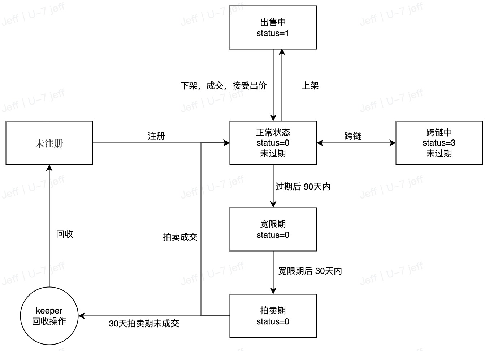

# 账户状态 & 生命周期

.bit 账户的状态复杂，需要仔细理解各个状态的定义和之间的转换关系，才能更好得基于 .bit 进行开发，进而为用户提供最佳的体验。


### 账户链上状态
从链上数据看，.bit 账户有以下几个状态：

| 状态  | 值   | 说明     |
|-----|-----|--------|
| 正常  | 0   | 账户正常使用 |
| 出售中 | 1   | 账户正常使用 |
| 跨链中 | 3   | 账户正常使用 |

你可以尝试以下命令来查看某个账户的状态：

```shell
curl -X POST https://indexer-v1.did.id/v1/account/info -d'{"account":"jeffx.bit"}'
```

### 账户逻辑状态
从实际业务出发，账户总共有以下几种逻辑状态：

**不可注册**  
收录在[不可注册账号名单](https://github.com/dotbitHQ/cell-data-generator/blob/master/data/unavailable_account_hashes.txt)中（黑名单）

**保留账号**  
收录在[保留账号名单](https://github.com/dotbitHQ/cell-data-generator/blob/master/data/reserved_accounts.txt)中

**未开放注册**  
不在黑名单、保留名单中，同时未被开放注册算法命中。查看[开放注册算法](../register-das/open-registration-rules.md)

**未注册**  
已开放注册，但是还未被注册，用户随时可以注册

**已注册（正常使用）**  
账号名已被注册（account-cell.status=0）

**出售中**  
账户已被注册，上架到[交易市场](https://did.top/)（account-cell.status=1）

**跨链中**  
账户已被注册，并[跨链到 ETH](./eth-nft.md) （account-cell.status=3）

**即将过期**  
账号过期前 30 天，即将过期。   
> 判断标准：当前时间 <= account-cell.expired_at <= 当前时间+30天

**宽限期**  
账号过期 90 天以内，还未被回收。
> 判断标准：当前时间-90天 <= account-cell.expired_at <= 当前时间

**拍卖期（开发中）**  
账号已过期，并被系统回收，进入 30 天的减价拍卖期。
> 判断标准：当前时间-120天 <= account-cell.expired_at <= 当前时间-90天


### 各个状态下的操作
由于状态之间的状态转换复杂，我们将各个状态的可进行的操作进行一一列举如下：

|  状态   | 注册  | 续费  | 编辑  | 反解  | 上架  | 下架  | 改价  | 购买  | 出价  | 修改出价 | 出价成交 |
|:-----:|:---:|:---:|:---:|:---:|:---:|:---:|:---:|:---:|:---:|:----:|:----:|
| 不可注册  |  ❌  |  ❌  |  ❌  |  ✅  |  ❌  |  ❌  |  ❌  |  ❌  |  ✅  |  ✅   |  ❌   |
| 未开放注册 |  ❌  |  ❌  |  ❌  |  ✅  |  ❌  |  ❌  |  ❌  |  ❌  |  ✅  |  ✅   |  ❌   |
|  未注册  |  ✅  |  ❌  |  ❌  |  ✅  |  ❌  |  ❌  |  ❌  |  ❌  |  ✅  |  ✅   |  ❌   |
|  已注册  |  ❌  |  ✅  |  ✅  |  ✅  |  ✅  |  ❌  |  ❌  |  ❌  |  ✅  |  ✅   |  ✅   |
|  出售中  |  ❌  |  ✅  |  ❌  |  ✅  |  ❌  |  ✅  |  ✅  |  ✅  |  ✅  |  ✅   |  ❌❗  |
|  跨链中  |  ❌  |  ❌  |  ❌  |  ✅  |  ❌  |  ❌  |  ❌  |  ❌  |  ✅  |  ✅   |  ❌   |
|  宽限期  |  ❌  | ✅❗  |  ❌  |  ✅  |  ❌  |  ❌  |  ❌  |  ❌  |  ✅  |  ✅   |  ❌   |

**特殊状态**
1. 跨链操作的 lock & mint
- 即将过期（过期前 30 天以内）：账号不能 lock
- 宽限期（过期后 90 天以内）：宽限期不能 lock，可以 mint
2. 出价成交
- 处于出售中状态的账号需要先下架，才可以和其他用户的出价成交
3. 续费
- 处于宽限期中的账号，如果处于跨链状态，则不能续费，需要先将账号转回 Nervos 链。防止两条链中的状态不一致


### 主要状态的转换（生命周期）


## FAQ

### 账户过期之后会怎么样？

:::tip
当前减价拍卖尚未启用，过了 90 天宽限期之后，**账户将被直接回收**。
:::

.bit 账户过期时间后，将进入 90 天的宽限期。

宽限期内完成续费，你将仍然拥有该 .bit 账户。

宽限期之内未续费，.bit 账户将进入为期 30 天的[减价拍卖](https://zh.wikipedia.org/wiki/%E9%80%86%E5%90%91%E6%8B%8D%E8%B3%A3)期，第一个出价人将获得该账户。

拍卖期结束后仍无人出价，账户将公开可注册，注册价格由账户的字符数决定。

### 为什么我的账户被回收后，没有进入减价拍卖期？

目前，减价拍卖机制尚未启用，过了宽限期之后账户将直接被回收。任何人都可以注册该账户。

### 我的 .bit 已经转换为 Ethereum 上的 NFT 了，也会被回收吗？

是的。无论你的 .bit 是否被转换为 Ethereum 上的 NFT，如果没有在宽限期内及时续费，你的 .bit 账户都会被自动回收。

### 我注册时支付的是 ETH / BNB / MATIC / TRX…。为什么账户过期后，我收到的存储押金是 CKB?

.bit 是运行在 Nervos CKB 上的一组智能合约，合约只能识别 & 接受 CKB 作为支付手段来进行付费。

为了用户方便得获得 .bit，我们提出了独一无二的[注册商](../contribute-to-das/registrar.md)角色。

注册商为用户提供注册界面，并且可以为用户提供承兑服务。用户可以支付不同的代币，例如 ETH, BNB, MATIC, TRX, USDT 等不同的代币（甚至是法币）注册 .bit 账户。

存储押金是在 .bit 合约回收账户后，.bit 合约将存储押金自动返还到当时的账户所有人，因此返还的是 CKB。

### 账户回收后，存储押金会自动退回吗？

是的。账户被回收后，存储押金将自动退回至该账户原 Owner 的的 [.bit 余额](https://balance.did.id/)中。你可以使用对应的钱包地址连接 [.bit 余额](https://balance.did.id/)查看。

### 我在哪里可以查看退还的存储押金？

你可以在 [.bit 余额](https://balance.did.id/)中查看自动退还的存储押金。


### 为什么账户回收有延迟？

账户过期时间以链上时间为准。账户回收所需要的时间取决于 CKB 网络，预计需要 10 ～ 30 分钟。[查看链上时间](https://app.did.id/explorer)。
